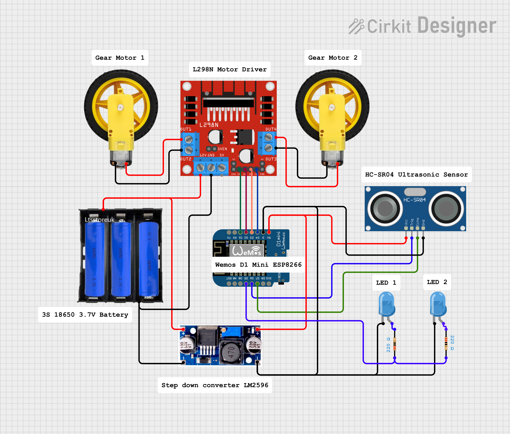

# IOT Smart Robotic Car

This project turns your **NodeMCU ESP8266** or **Wemos D1 Mini** into a fully functional
Wi-Fi controlled **robot car** with a modern web interface, real-time WebSocket control, 
ultrasonic collision avoidance, and a persistent LED indicator that blinks automatically 
when an obstacle is detected.

---

## Features:

-  **Wi-Fi Access Point + Captive Portal** — Control the robot without needing a router  
-  **WebSocket Real-Time Control** — Instant commands: Forward, Backward, Left, Right, Stop  
-  **Modern Web UI** — Responsive, mobile-friendly control panel with live status  
-  **HC-SR04 Collision Detection** — Automatically blocks forward motion when obstacles are too close  
-  **LED Status Indicator** — Blinks when a collision is detected, or manually toggled  
-  **Persistent State** — LED toggle state is preserved even after clearing obstacles  

---

## Hardware Requirements:

- ESP8266 (NodeMCU or Wemos D1 Mini)  
- L298N Motor Driver Module  
- 2 × DC Gear Motors + Wheels  
- HC-SR04 Ultrasonic Sensor  
- 1 × LED (for collision indication)  
- 3 × 18650 3S Battery Pack  
- Robot Car Chassis

---

## Circuit Diagram:
 

## Pin Mapping:

| Component                  | ESP8266 Pin | Description                              |
|---------------------------|-------------|------------------------------------------|
| **Motor Driver IN1**      | D1          | Left motor forward                       |
| **Motor Driver IN2**      | D2          | Left motor backward                      |
| **Motor Driver IN3**      | D3          | Right motor forward                      |
| **Motor Driver IN4**      | D4          | Right motor backward                     |
| **LED Indicator**         | D5          | External status LED                      |
| **HC-SR04 Trigger**       | D6          | Ultrasonic sensor trigger pin            |
| **HC-SR04 Echo**          | D7          | Ultrasonic sensor echo pin               |

---

## Default Wi-Fi Access Point:

| Setting       | Value           |
|--------------|------------------|
| **SSID**     | `RobotCar_AP`    |
| **Password** | `12345678`       |
| **Web UI**   | `http://192.168.4.1` |

> Connect your phone or laptop to the robot's Wi-Fi network and open the control panel at `http://192.168.4.1`.

---

## How It Works:

1. The ESP8266 creates its own Wi-Fi network and hosts a web control page.  
2. The **WebSocket server** processes movement commands and LED toggles in real time.  
3. The **HC-SR04 ultrasonic sensor** continuously measures distance.  
4. If an obstacle is closer than `20 cm`, the robot:  
   - Stops immediately  
   - Disables forward motion  
   - Starts blinking the LED automatically  
5. Once the obstacle is cleared, forward control is re-enabled and LED returns to its previous state.

---
## Author

**Created with Passion ❤ by:** Roy Cuadra  
**Year:** 2025  
 
---

